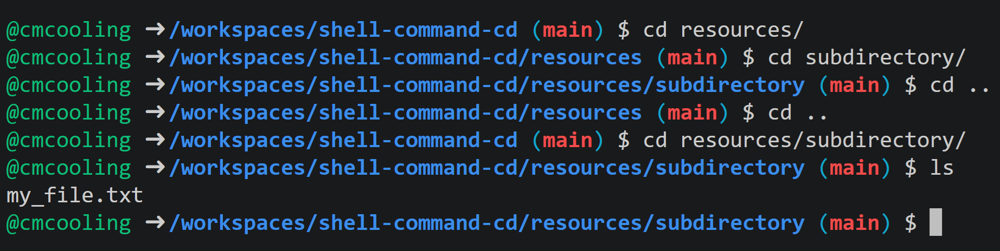

The `cd`{.bash} command (short for "change directory") is used to change the current directory of the shell. It is available in shells in all Unix-like systems and some others, including:

* bash
* zsh
* PowerShell (technically an alias for `Set-Location`{.bash})

# Usage

The basic syntax of the `cd`{.bash} command is `cd`{.bash} followed by a path to the desired directory. This is most commonly a relative path, but can be an absolute path. `cd ..`{.bash} allows you to move up one level in the directory tree.

# Example

This example takes place in the file structure of the files associated with this page. The structure of these files is:

```
.
├── content.html
├── license.md
├── metadata.json
└── resources/
    ├── cd_example.png
    ├── placeholder.txt
    └── subdirectory/
        └── my_file.txt
```

The image below shows how the `cd`{.bash} command can be used to navigate this file structure. The path to the current directory is shown in the prompt.



# Changing to the Home Directory

In most shells, you can use the `cd`{.bash} command without any arguments or with a tilde `cd ~`{.bash} as a shortcut to change to the home directory.

# Try it Yourself

Use the button at the top of the page to open a Codespace. The files associated with this page will be available for you to explore.In the terminal, practice using the `cd`{.bash} command to navigate the file structure.
